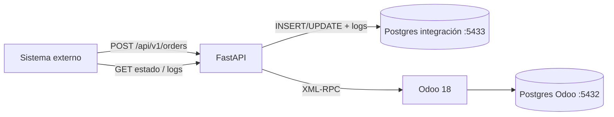
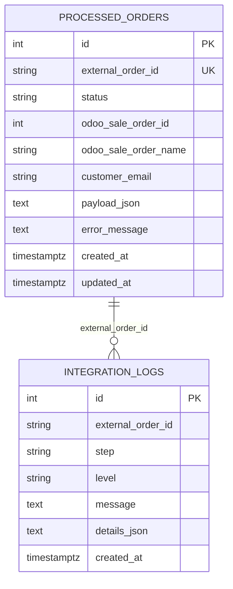

# Diagrama lógico y de datos

## 1) Flujo lógico (sistemas)

```text
┌──────────────────┐      HTTP POST /api/v1/orders      ┌────────────────────────────┐
│ Sistema externo  │ ─────────────────────────────────► │  API FastAPI (Python)       │
│ (marketplace /   │                                    │  - valida payload           │
│  B2B / ERP)      │ ◄───────────────────────────────── │  - anti-duplicados          │
└──────────────────┘      200 / 409 / 422 + estado      │  - orquesta negocio         │
                                                        └─────────────┬──────────────┘
                                                                      │
                         ┌────────────────────────────────────────────┼──────────────────────────┐
                         │                                            │                          │
                         ▼                                            ▼                          ▼
              ┌─────────────────────┐                     ┌─────────────────────┐     ┌─────────────────────┐
              │ Postgres integración│                     │ Odoo 18 (XML-RPC)   │     │ Postgres Odoo       │
              │ :5433 / integration │                     │ :8069               │     │ :5432 (interno)     │
              │                     │                     │                     │     │                     │
              │ processed_orders    │                     │ res.partner         │     │ tablas Odoo         │
              │ integration_logs    │                     │ product.product     │     │ (no las tocamos)    │
              └─────────────────────┘                     │ sale.order          │     └─────────────────────┘
                                                          │ sale.order.line     │
                                                          └─────────────────────┘
```

### Pasos del procesamiento

1. Llega JSON con `external_order_id`, cliente y líneas.
2. Validación Pydantic (ID, email, cantidad > 0, precio >= 0, al menos 1 línea).
3. Si ya existe con `status=created` → **no duplicar** (HTTP 409).
4. Si existía `failed` → **reintento**.
5. Buscar/crear cliente en Odoo (`res.partner` por email).
6. Validar cada SKU (`product.product` / `default_code`).
7. Crear `sale.order` + líneas; guardar ID externo en `client_order_ref`.
8. Persistir resultado en `processed_orders` y cada paso en `integration_logs`.
9. Consulta posterior: `GET /api/v1/orders/{external_order_id}` y `/logs`.

## 2) Modelo entidad-relación (persistencia de integración)

```text
┌──────────────────────────────────────────────┐
│              processed_orders                │
├──────────────────────────────────────────────┤
│ PK  id                    INTEGER            │
│ UQ  external_order_id     VARCHAR(120)       │  ← clave de negocio
│     status                VARCHAR(40)        │  received|validating|created|failed
│     odoo_sale_order_id    INTEGER NULL       │
│     odoo_sale_order_name  VARCHAR(120) NULL  │  ej. S00001
│     customer_email        VARCHAR(255) NULL  │
│     payload_json          TEXT NULL          │
│     error_message         TEXT NULL          │
│     created_at            TIMESTAMPTZ        │
│     updated_at            TIMESTAMPTZ        │
└──────────────────────┬───────────────────────┘
                       │ 1 : N  (por external_order_id)
                       ▼
┌──────────────────────────────────────────────┐
│              integration_logs                │
├──────────────────────────────────────────────┤
│ PK  id                    INTEGER            │
│ IX  external_order_id     VARCHAR(120)       │
│     step                  VARCHAR(80)        │  received, validate, find_customer, ...
│     level                 VARCHAR(20)        │  info|warning|error
│     message               TEXT               │
│     details_json          TEXT NULL          │
│     created_at            TIMESTAMPTZ        │
└──────────────────────────────────────────────┘
```

Relación lógica (no FK estricta en código actual):  
`processed_orders.external_order_id` ↔ `integration_logs.external_order_id`.

## 3) Relación con entidades Odoo (conceptual)

```text
processed_orders.odoo_sale_order_id  ──►  sale.order.id
processed_orders.odoo_sale_order_name ─►  sale.order.name          (S00001)
payload.customer.email               ──►  res.partner.email
payload.lines[].sku                  ──►  product.product.default_code
sale.order.client_order_ref          ◄──  external_order_id        (referencia visible en Odoo)
```

## 4) Diagrama Mermaid (para renderizar en GitHub)





## 5) Cómo explicarlo en 45 segundos

> “El sistema externo no habla directo con Odoo. Pega a mi API. Yo valido, evito
> duplicados con `external_order_id`, creo o asocio el cliente, verifico SKUs,
> creo la orden de venta y dejo trazabilidad en mi Postgres. Odoo guarda el
> pedido comercial; mi base guarda el resultado de cada intento de integración.”
